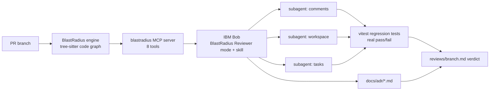

# BlastRadius

**Review the blast radius, not the diff.** BlastRadius maps everything a pull request can break and hands that map to IBM Bob. Bob reviews in a custom mode, sends a subagent into each affected subsystem, checks the team's ADRs, and writes regression tests. Then it runs them.

Built for the IBM Bob 2.0 Hackathon on lablab.ai. Workflow: **code review**.

- Code: https://github.com/Prashant-thakur77/Blast-Radius

- Live demo: https://site-seven-zeta-33.vercel.app (source in `site/`; run locally with `python3 -m http.server -d site 8765`)
- Video: `video/build/blastradius_demo.mp4` (under 3 minutes)
- Bob evidence: [`bob_sessions/`](bob_sessions/)

## The problem

A reviewer sees the diff. The damage usually sits in the code the diff doesn't show.

Our hero example, PR-3 on the Pulse sample app, is a feature plus a small refactor. It swaps the argument order of `getWorkspaceMember(workspaceId, userId)` and updates 17 of its 18 call sites. The one it misses, `comments/[commentId]/route.ts:18`, still passes `(workspaceId, user.id)`. Both arguments are strings, so TypeScript passes, CI is green, and two approvals later every real member gets a 403 when they edit a comment. The same PR also adds an archive endpoint that never writes to the activity log, which breaks a written team rule (ADR-002).

Nothing in the 19-file diff points at either bug.

## How it works



1. **The engine** (`blastradius/backend/app/review/`) parses the base and head of a branch straight from git with tree-sitter. It needs no database and no LLM. For the head it computes:
   - Changed units, and the dependents reached through reverse call and render edges.
   - Subsystems affected.
   - Signature changes, and callers that were not updated for them. This is the missed-caller detector: it checks each call site's arguments against the old and new parameter order.
   - Untested units, and ADR sections in scope.
   - A 0–100 score in which every point has a written reason.
2. **The MCP server** (`app/mcp_server.py`) gives Bob 8 tools: `analyze_pr`, `get_dependents`, `get_subsystem`, `find_untested`, `check_docs`, `run_tests`, `build_graph`, `summarize_review`.
3. **Bob does the review.** The `BlastRadius Reviewer` custom mode, its protocol rules and the `blast-radius-review` skill tell Bob to:
   - Analyze the PR, and stop for a human when the score is 70 or more or a caller was left behind.
   - Read the ADRs.
   - Send one subagent per risky subsystem to write and run a vitest regression test.
   - Propose fixes, and apply them only after a yes.
4. **Granite writes the summary** (`app/review/granite.py`) on watsonx.ai with `ibm/granite-4-h-small` when credentials are set. It only narrates the JSON evidence and is told not to add facts. Without credentials it falls back to a template.

## IBM Bob at the core

| Bob feature | Where | What it does in BlastRadius |
|---|---|---|
| MCP server | `.bob/mcp.json`, `blastradius/backend/app/mcp_server.py` | Bob's map of the code: score, dependents, missed callers, ADRs, test runs |
| Custom mode | `.bob/custom_modes.yaml` | `BlastRadius Reviewer`: read, MCP, skill, subagent and execute groups; edits limited to regression tests, review reports and approved fixes |
| Mode rules | `.bob/rules-blast-radius-reviewer/01-review-protocol.md` | Evidence rules, stop conditions, subagent brief, report format |
| Skill | `.bob/skills/blast-radius-review/SKILL.md` | The 9-step review procedure, reusable from any mode |
| Subagents | the skill, step 6 | One `general` subagent per risky subsystem, in parallel, each writing and running one test |
| Document understanding | `pulse/docs/adr/*.md`, `check_docs` | Bob judges each ADR rule as violated, respected or not applicable, with the file and line |
| `/init`, AGENTS.md | `AGENTS.md` | Written by Bob in task 01 |
| Code review | `/review` | Bob reviews this repo (task 06) |
| Bob Shell | `.github/workflows/blastradius.yml` | `bob run` in CI after the CLI gate |
| `.bobignore` | `.bobignore` | Keeps secrets, databases and `node_modules` out of Bob's reads |

Every Bob task we ran is listed in [`bob_sessions/README.md`](bob_sessions/README.md), with a screenshot of its consumption summary.

## Quick start

```bash
git clone https://github.com/Prashant-thakur77/Blast-Radius.git && cd Blast-Radius

# 1. Backend engine (Python 3.10+)
cd blastradius/backend && python3 -m venv .venv && .venv/bin/pip install -r requirements.txt && cd ../..

# 2. Sample app deps and the three seeded PR branches
(cd pulse && npm install) && ./scripts/seed_demo.sh

# 3. Review a branch from the command line (exit code 2 when score >= 70)
cd blastradius/backend && .venv/bin/python -m app.cli review \
  --repo ../../demo-workspace/pulse --head pr-3-task-archiving --fail-on 70
```

Then open the repo in **Bob IDE 2.0.2 or later**, trust the workspace, check that the `blastradius` MCP server is connected, switch to **BlastRadius Reviewer**, and ask: `Review branch pr-3-task-archiving.` The paths in `.bob/mcp.json` are absolute; change them to your clone.

Tests:

```bash
cd blastradius/backend && .venv/bin/pytest tests/test_review_engine.py   # 11 engine tests
cd pulse && npx vitest run                                                # regression harness
```

## Results on the seeded PRs

Measured with `scripts/export_site_data.py`. Every run gives the same numbers.

| PR | What it changes | Files in diff | Files in blast radius | Dependents | Subsystems | Score | Engine time |
|---|---|---:|---:|---:|---:|---:|---:|
| PR-1 | Dashboard copy | 1 | 2 | 1 | 1 | 6 low | ~0.9 s |
| PR-2 | `getSession` rejects tokens older than `SESSION_EPOCH` (3 lines) | 1 | 34 | 34 | 13 | 70 high | ~0.9 s |
| PR-3 | Task archiving + `getWorkspaceMember` argument swap | 19 | 20 | 19 | 9 | 95 critical | ~0.9 s |

On PR-3 the engine flags the one missed caller at `comments/[commentId]/route.ts:18`. In our recorded Bob session (task 05), Bob stopped at the gate and sent three subagents (workspace, tasks, comments). They wrote 7 vitest tests, and 2 failed: `expected 403 to be 200` on the comment route, and no activity event from `archiveTask` (ADR-002). Bob applied the fixes after approval and all 5 affected tests passed. Its report is in `reviews/pr-3-task-archiving.md`, and the tests and fixes are in `reviews/pr-3-task-archiving/`. We also checked the 403 failure outside Bob, so the demo doesn't depend on the model getting lucky.

## Repo layout

| Path | What |
|---|---|
| `blastradius/backend/app/review/` | Review engine: `engine.py`, `subsystems.py`, `gitrefs.py`, `granite.py` |
| `blastradius/backend/app/mcp_server.py`, `app/cli.py` | MCP server for Bob; CLI for humans and CI |
| `blastradius/backend/app/services/parser/` | tree-sitter TypeScript/TSX parser (units and edges) |
| `blastradius/frontend/` | Next.js 3D graph explorer (older UI, uses the REST API) |
| `site/` | Static demo site with the 3D blast view and the three reports |
| `pulse/` | Our own sample app: ADRs in `docs/adr/`, vitest harness in `src/__regression__/` |
| `demo/prs/` + `scripts/seed_demo.sh` | The three seeded PRs as patches, and the script that builds `demo-workspace/pulse` |
| `.bob/`, `AGENTS.md`, `.bobignore` | Bob configuration |
| `video/` | Narration script, scene page, renderer (Chatterbox TTS, Playwright, ffmpeg) |

## What existed before the hackathon, and what we built during it

The git history has two parts. The first commit is the code as it stood before the event: the TypeScript parser, the REST API with the per-commit graph snapshots, and the Next.js 3D explorer, which ran on OpenAI. Everything after it was built during the event:
- the review engine and missed-caller detector
- the MCP server and all of `.bob/`
- the seeded PRs, ADRs and vitest harness
- the CLI, the Granite summarizer, the site and the video

We removed an earlier agent integration for another platform and a hardcoded key.

**Tools:** IBM Bob IDE ran the reviews, wrote `AGENTS.md` and reviewed the repo. See `bob_sessions/` for each task. We also used Claude Code to write much of the engine, the site and the video pipeline.

## Data and licenses

- Pulse is a sample app we wrote. It contains no user data.
- Music: "Inspired" by Kevin MacLeod (incompetech.com), licensed under Creative Commons: By Attribution 4.0 (https://creativecommons.org/licenses/by/4.0/). Source: https://incompetech.com/music/royalty-free/
- Narration: generated with Chatterbox TTS (Resemble AI, MIT license), using its default voice.
- Fonts: EB Garamond and Figtree (SIL Open Font License), JetBrains Mono (OFL), via Google Fonts.
- three.js (MIT) is vendored in `site/vendor/`.
- The site's colors and type take their cue from the Wispr Flow website. No assets were copied.

BlastRadius is MIT licensed. See [LICENSE](LICENSE).
