<div align="center">

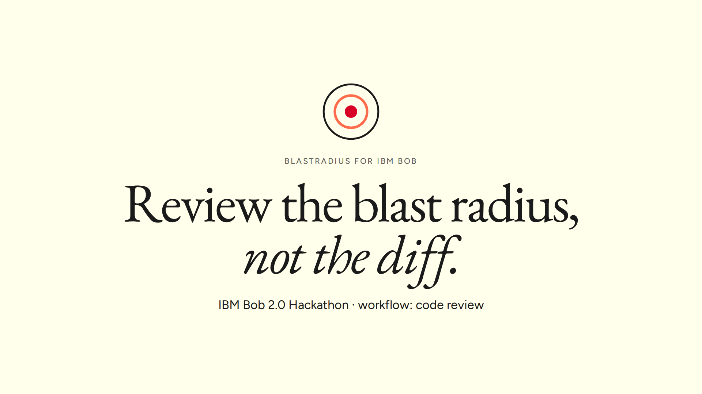

# BlastRadius

**Review the blast radius, not the diff.**

BlastRadius maps everything a pull request can break and hands that map to **IBM Bob**. Bob reviews in a custom mode, checks the team's ADRs, sends a subagent into each affected subsystem, then writes regression tests and runs them.

[Live demo](https://site-seven-zeta-33.vercel.app) · [Demo video](docs/media/BlastRadius_demo.mp4) · [Slides](submission/BlastRadius_slides.pdf) · [Bob session evidence](bob_sessions/README.md) · [Design and diagrams](docs/DESIGN.md) · [Releases](https://github.com/Prashant-thakur77/Blast-Radius/releases)

Built for the **IBM Bob 2.0 Hackathon** on lablab.ai · Workflow: **code review** · MIT licensed

</div>

---

<p align="center">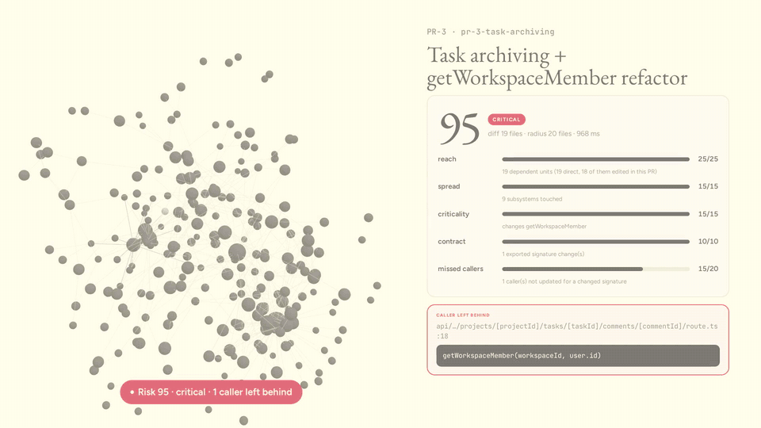</p>

## In 30 seconds

- A pull request swaps the argument order of `getWorkspaceMember(workspaceId, userId)` and updates 17 of its 18 callers. Both arguments are strings, so TypeScript passes and CI is green. The one missed caller locks real members out of editing comments.
- BlastRadius scores that PR **95/100 (critical)** in under a second and points at the exact line: `comments/[commentId]/route.ts:18`.
- IBM Bob, in our **BlastRadius Reviewer** mode, stopped at the gate and sent **three subagents in parallel**. They wrote 7 regression tests; **2 failed** (`expected 403 to be 200`, and a missing activity event that breaks ADR-002). Bob proposed the fixes and applied them after approval, and **5 of 5** tests passed. You can watch it happen in the [demo video](docs/media/BlastRadius_demo.mp4).

## Demo video (2:51)

<p align="center"><a href="docs/media/BlastRadius_demo.mp4">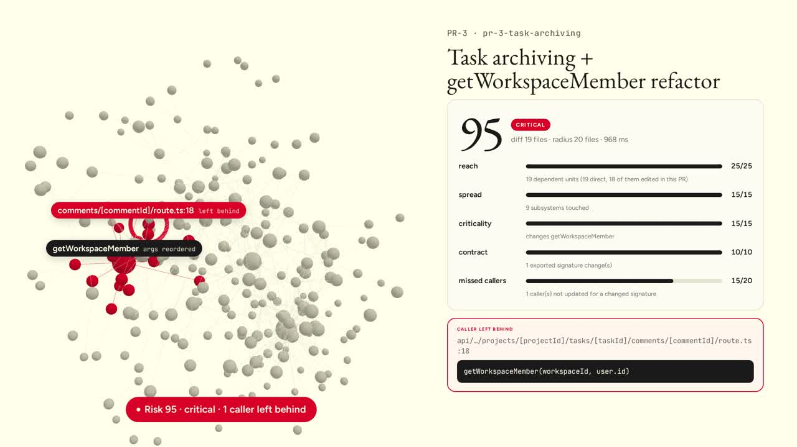</a></p>
<p align="center">Click the image to play <code>docs/media/BlastRadius_demo.mp4</code>, or watch it on the <a href="https://site-seven-zeta-33.vercel.app/#session">live site</a>. The PR-3 section is real IBM Bob IDE footage.</p>

## The problem

Code review happens on the diff. The damage a pull request does usually sits in code the diff doesn't show: callers in other subsystems, tests that don't exist, and team rules nobody re-read.

Our hero PR on the Pulse sample app adds task archiving and a small refactor. The refactor reorders `getWorkspaceMember` to `(userId, workspaceId)` and updates 17 call sites. The 18th, `comments/[commentId]/route.ts:18`, still passes `(workspaceId, user.id)`. It compiles, and every real member then gets a 403 when editing or deleting a comment. The same PR adds an archive endpoint that never writes to the activity log, breaking a written team rule (ADR-002).

The diff has 19 tidy files, and none of them points at either bug.

## What IBM Bob did with it (a recorded session)

<table>
<tr>
<td width="33%">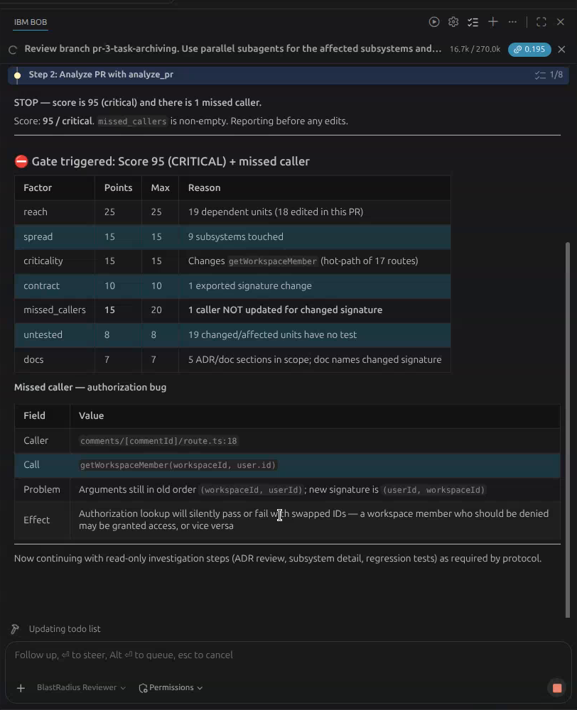</td>
<td width="33%">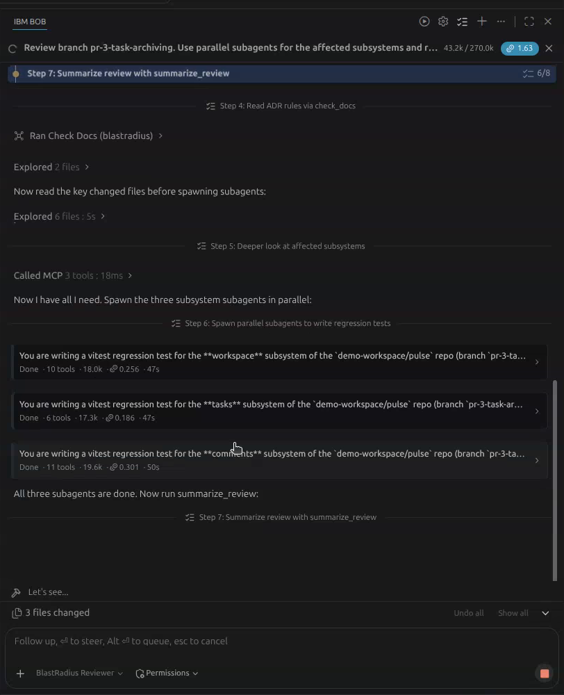</td>
<td width="33%">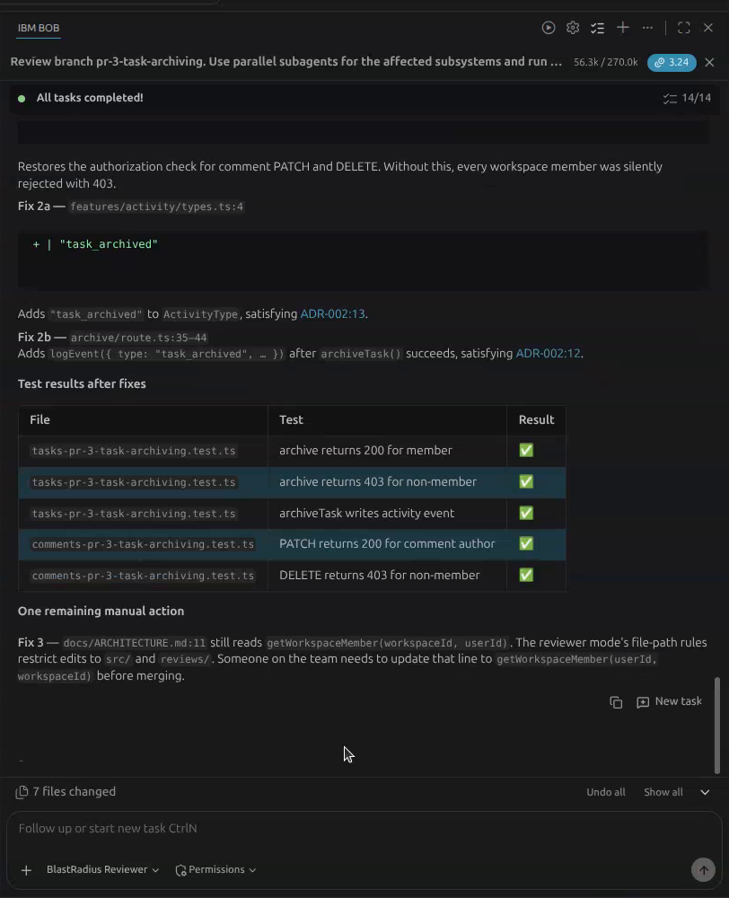</td>
</tr>
<tr>
<td>Risk 95. Bob stops and reports the missed caller before touching anything.</td>
<td>Three subagents (workspace, tasks, comments) each write a vitest test.</td>
<td>After the approved fixes, 5 of 5 tests pass.</td>
</tr>
</table>

Tests Bob's subagents wrote and ran on `pr-3-task-archiving`:

| Test file | Test | Before fix | After fix |
|---|---|---|---|
| `tasks-pr-3-task-archiving.test.ts` | archive returns 200 for member | ✅ | ✅ |
| `tasks-pr-3-task-archiving.test.ts` | archive returns 403 for non-member | ✅ | ✅ |
| `tasks-pr-3-task-archiving.test.ts` | archiveTask writes activity event | ❌ `expected 0 to be greater than 0` | ✅ |
| `comments-pr-3-task-archiving.test.ts` | PATCH returns 200 for comment author | ❌ `expected 403 to be 200` | ✅ |
| `comments-pr-3-task-archiving.test.ts` | DELETE returns 403 for non-member | ✅ | ✅ |
| `workspace-pr-3-task-archiving.test.ts` | PATCH returns 200 for owner | ✅ | not rerun |
| `workspace-pr-3-task-archiving.test.ts` | PATCH returns 403 for non-member | ✅ | not rerun |

Bob's full report is [`reviews/pr-3-task-archiving.md`](reviews/pr-3-task-archiving.md). The test files and the fixes it applied are in [`reviews/pr-3-task-archiving/`](reviews/pr-3-task-archiving/). Bob also noticed that `docs/ARCHITECTURE.md` still documents the old signature, and left it as a manual follow-up because the Reviewer mode is not allowed to edit docs.

## What happens when you ask Bob to review a branch

This is the flow Bob followed in our recorded PR-3 session, driven by the `blast-radius-review` skill and the Reviewer mode rules:

1. **Checkout.** Bob runs `git checkout pr-3-task-archiving` in the demo repo.
2. **Map.** Bob calls `analyze_pr`. BlastRadius parses `main` and the branch with tree-sitter and returns the evidence as JSON:
   - the changed units and their dependents
   - the subsystems affected
   - the signature change on `getWorkspaceMember`
   - the missed caller at `comments/[commentId]/route.ts:18`
   - the untested units and the ADRs in scope
   - the score, 95, with a reason for each factor
3. **Gate.** The mode rules say to stop at a score of 70 or more, or on any missed caller. Bob reports the finding and edits nothing until the human replies.
4. **Rules.** Bob calls `check_docs`, reads ADR-001 and ADR-002, and judges each rule against the changed code. It cites the ADR file and line for each one.
5. **Subagents.** Bob calls `get_subsystem` for each risky subsystem, then spawns three `general` subagents in parallel: workspace, tasks and comments. Each subagent writes one vitest file in `src/__regression__/`. The files use the harness helpers (`seedWorkspace`, `signInAs`, `jsonRequest`, `activityFor`) and run against an in-memory SQLite copy of the real schema.
6. **Proof.** The tests run. Two fail, and each failure is a finding: a member gets a 403 on their own comment, and archiving writes no activity event.
7. **Fix, with approval.** Bob proposes three small diffs. After the human says yes, it applies them and reruns the two affected test files: 5 of 5 pass.
8. **Report.** Bob writes `reviews/pr-3-task-archiving.md` with the verdict, the score table, the findings, the test results and the fixes. It also leaves one manual follow-up: `docs/ARCHITECTURE.md` still names the old signature, and the mode is not allowed to edit docs.

## Screenshots

| | |
|---|---|
| 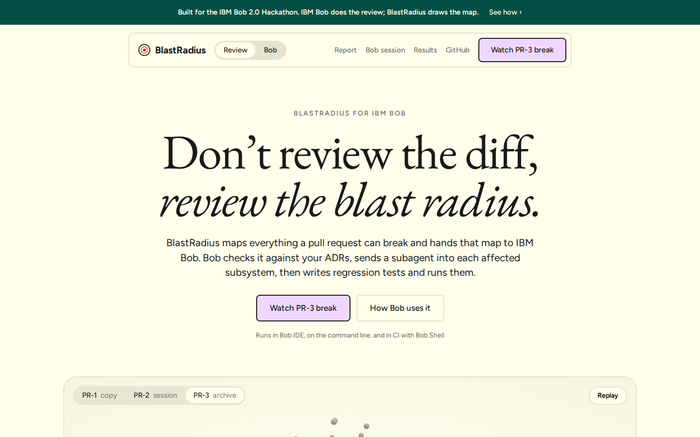 | 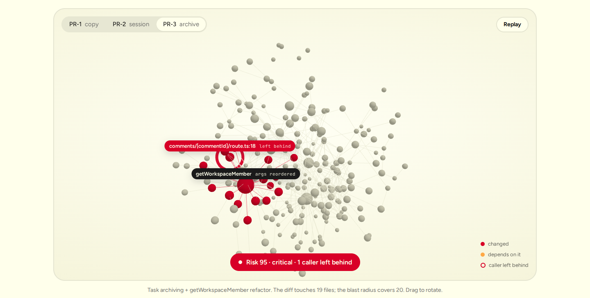 |
| Landing page of the live demo | 3D blast view: changed units in red, the caller left behind ringed |
| 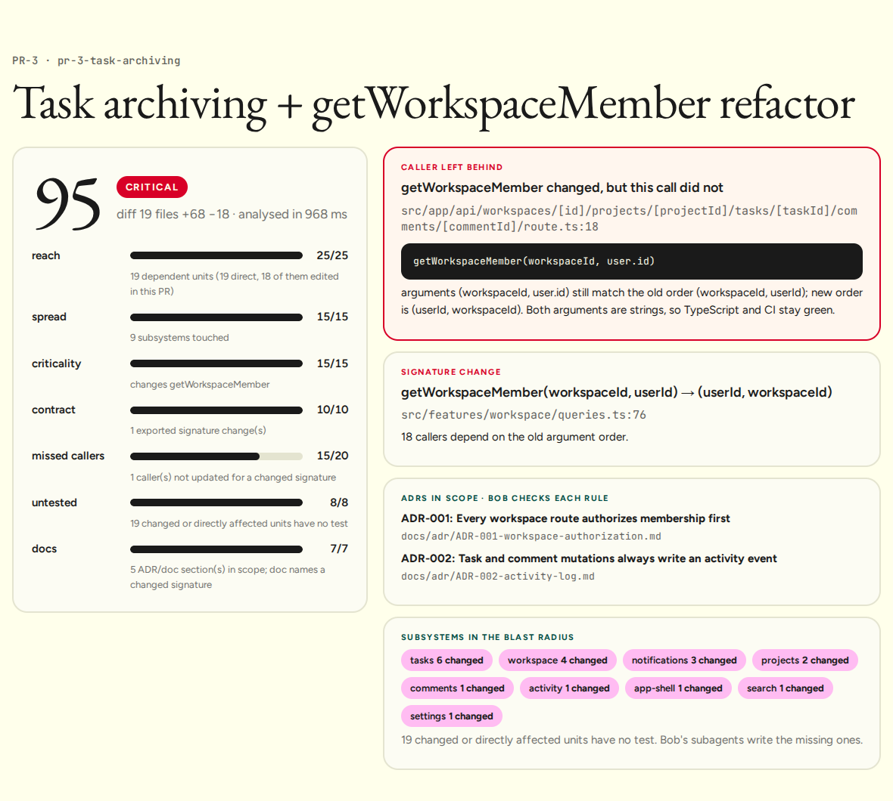 | 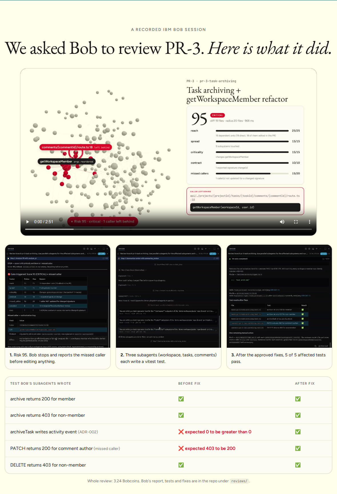 |
| Score breakdown and findings for PR-3 | The recorded Bob session, with video and test results |
| 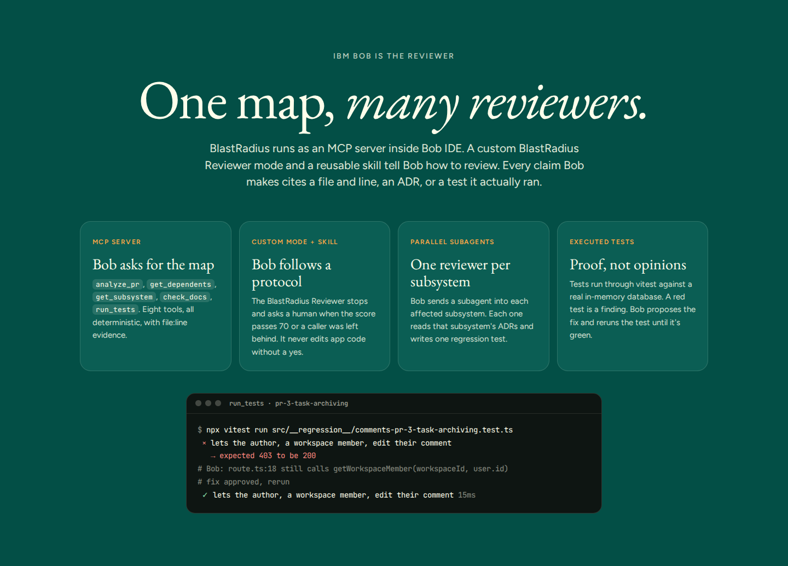 | 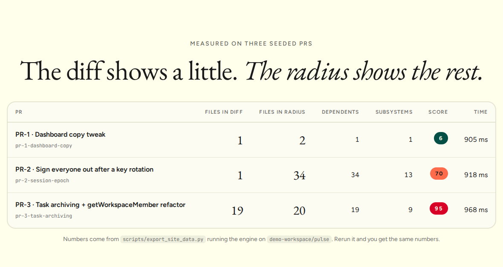 |
| How Bob uses BlastRadius | Measured results on the three seeded PRs |
| 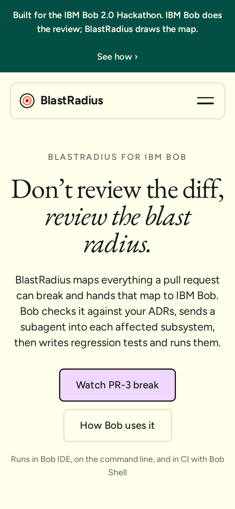 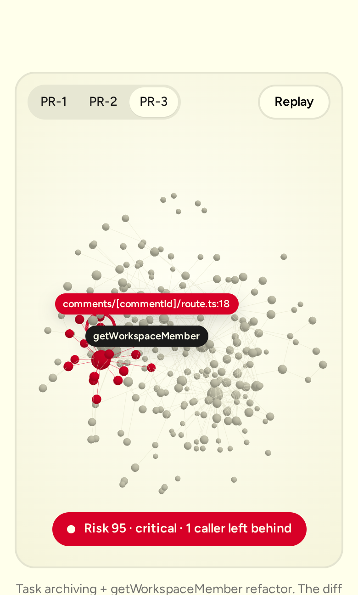 | 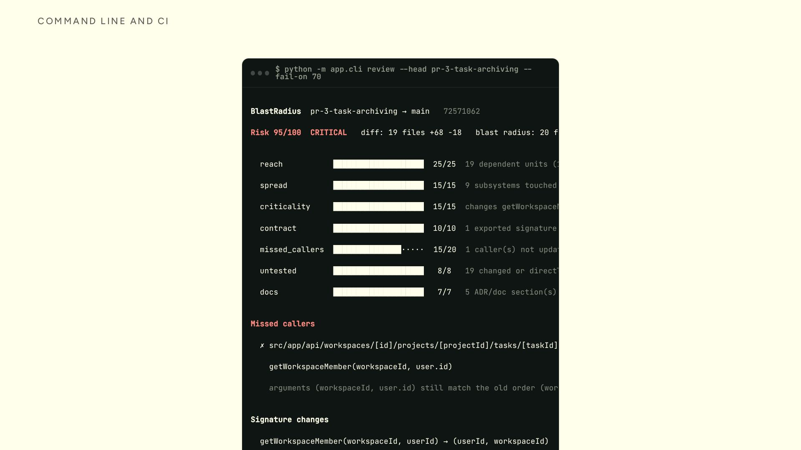 |
| The site on a phone | The CLI on PR-3, exiting with code 2 for CI |

## How this maps to the judging criteria

| Criterion | What to look at |
|---|---|
| **Application of Technology**: a clear application of IBM Bob 2.0 | Bob does the review through an MCP server, a custom mode, a skill, mode rules, parallel subagents and document understanding (ADRs). It also runs in CI through Bob Shell. See [IBM Bob at the core](#ibm-bob-at-the-core) and [`bob_sessions/`](bob_sessions/README.md). |
| **Presentation** | A live demo with a 3D blast view, a narrated 2:51 video with real Bob footage, slides, and this README. |
| **Business Value**: a high-priority issue | Bugs that pass CI and review ship to production and cost rework. On our seeded PRs the diffs showed 21 files and the blast radius covered 56. Bob caught both hidden bugs before merge, with tests as proof, for 3.24 Bobcoins. |
| **Originality**: the approach to applying Bob | Bob is the reviewer, not a coding helper. A deterministic engine hands it evidence with file:line references, and Bob proves each finding with tests it wrote and ran. The missed-caller detector catches argument-order bugs that type checkers miss. |

## How it works

The full design, with nine diagrams (architecture, review flow, engine pipeline, missed-caller detection, score, CI, demo repo, video pipeline and plan), is in [`docs/DESIGN.md`](docs/DESIGN.md). Editable versions are in [`docs/diagrams/`](docs/diagrams/), including [`blastradius.drawio`](docs/diagrams/blastradius.drawio).

<p align="center">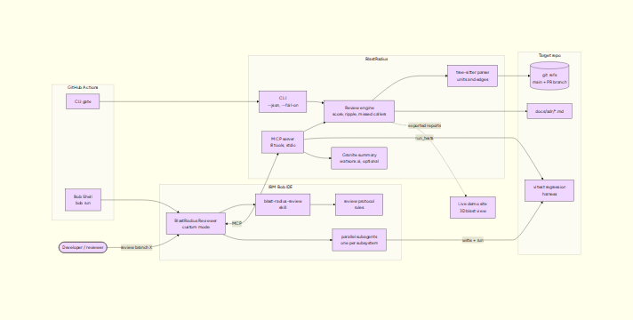</p>

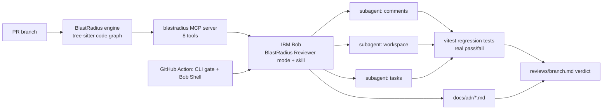

1. **The engine** (`blastradius/backend/app/review/`) parses the base and head of a branch straight from git with tree-sitter. It needs no database, network or LLM. For the head it computes:
   - Changed units, and every dependent reached through reverse call and render edges.
   - The subsystems affected.
   - Signature changes, and **callers left behind**. For each caller the PR didn't update, it compares the call's arguments against the old and new parameter order.
   - Untested units, and the ADR and doc sections in scope. It flags a doc that still names a changed signature.
   - A 0–100 score in which every point has a written reason.
2. **The MCP server** (`app/mcp_server.py`) gives Bob 8 tools: `analyze_pr`, `get_dependents`, `get_subsystem`, `find_untested`, `check_docs`, `run_tests`, `build_graph`, `summarize_review`.
3. **Bob reviews.** The **BlastRadius Reviewer** custom mode, its protocol rules and the `blast-radius-review` skill tell Bob to:
   - Analyze the PR, and stop for a human at score 70 or more or when a caller was left behind.
   - Read the ADRs and judge each rule.
   - Send one subagent per risky subsystem to write and run a regression test.
   - Propose fixes, and apply them only after a yes.
4. **Granite writes the summary.** `app/review/granite.py` calls `ibm/granite-4-h-small` on watsonx.ai. It passes only the JSON evidence, with temperature 0, a fixed seed and a no-invention prompt. Without credentials it falls back to a template, so the review never fails because the narrator did. The recorded demo ran without watsonx credentials, so its summaries came from the template.

### The score

| Factor | Max | What earns points |
|---|---:|---|
| reach | 25 | Dependents, weighted by distance, including callers the PR itself edited |
| spread | 15 | Number of subsystems touched |
| criticality | 15 | Changes to auth, session, membership or db code, or to a hub with 10+ callers |
| contract | 10 | Exported signature changes |
| missed_callers | 20 | Callers not updated for a changed signature |
| untested | 8 | Changed or directly affected units with no test |
| docs | 7 | ADR and doc sections in scope, plus doc drift |

Bands: under 30 low, 30–59 medium, 60–79 high, 80 and up critical.

## IBM Bob at the core

| Bob feature | Where | What it does in BlastRadius | Evidence |
|---|---|---|---|
| MCP server | `.bob/mcp.json`, `blastradius/backend/app/mcp_server.py` | Bob's map of the code: score, dependents, missed callers, ADRs, test runs | tasks 03–05 |
| Custom mode | `.bob/custom_modes.yaml` | **BlastRadius Reviewer**: read, MCP, skill, subagent and execute groups; edits limited to regression tests, review reports and approved fixes | tasks 03–05 |
| Mode rules | `.bob/rules-blast-radius-reviewer/01-review-protocol.md` | Evidence rules, stop conditions, subagent brief, report format | task 05 gate |
| Skill | `.bob/skills/blast-radius-review/SKILL.md` | The 9-step review procedure, reusable from any mode | tasks 03–05 |
| Parallel subagents | skill step 6 | One `general` subagent per risky subsystem; each writes and runs one test | task 05 |
| Document understanding | `pulse/docs/adr/*.md`, `check_docs` | Judges each ADR rule as violated, respected or not applicable, with the file and line | tasks 02, 05 |
| `/init` and AGENTS.md | `AGENTS.md`, `.bob/rules-{agent,ask,plan}/` | Written by Bob | task 01 |
| Code review | Agent mode | Bob reviewed the engine and listed edge cases, each with a line number, severity and fix | task 06 |
| PR authoring | Agent mode | Bob wrote the PR description for the hackathon work | task 07 |
| Bob Shell | `.github/workflows/blastradius.yml` | `bob run` writes the review in CI after the CLI gate | workflow file |
| `.bobignore` | `.bobignore` | Keeps `.env`, databases and `node_modules` out of Bob's reads | |

### Bob session evidence

Every task is listed with its screenshot in [`bob_sessions/README.md`](bob_sessions/README.md).

| Task | Mode | Result | Bobcoins |
|---|---|---|---:|
| 01 `/init` | Agent | Wrote `AGENTS.md` and three mode rule files | |
| 02 ADR checklist | Ask | Reviewer checklist from the architecture doc and three ADRs | 0.07 |
| 03 Review PR-1 | BlastRadius Reviewer | APPROVE, score 6 (low) | 0.30 |
| 04 Review PR-2 | BlastRadius Reviewer | APPROVE WITH NOTES, score 70 (high), 11 flows to click through | 0.62 |
| 05 Review PR-3 | BlastRadius Reviewer | REQUEST CHANGES, score 95, 3 subagents, 7 tests (2 red), fixes applied, 5/5 green | 3.24 |
| 06 Code review | Agent | Edge cases in `engine.py`, each with a line number, severity and fix | 0.22 |
| 07 PR description | Agent | PR description with an "IBM Bob features used" table | 0.35 |

Tasks 02 to 07 used about **4.8 Bobcoins** of the 40 available.

## Results on the seeded PRs

Measured with `scripts/export_site_data.py`. Every run gives the same numbers.

| PR | What it changes | Files in diff | Files in blast radius | Dependents | Subsystems | Score | Engine time |
|---|---|---:|---:|---:|---:|---:|---:|
| PR-1 | Dashboard copy | 1 | 2 | 1 | 1 | 6 low | ~0.9 s |
| PR-2 | `getSession` rejects tokens older than `SESSION_EPOCH` (3 lines) | 1 | 34 | 34 | 13 | 70 high | ~0.9 s |
| PR-3 | Task archiving + `getWorkspaceMember` argument swap | 19 | 20 | 19 | 9 | 95 critical | ~0.9 s |

Across the three PRs the diffs showed 21 files, and the blast radius covered 56.

## Quick start

```bash
git clone https://github.com/Prashant-thakur77/Blast-Radius.git && cd Blast-Radius

# 1. Engine (Python 3.10+)
cd blastradius/backend && python3 -m venv .venv && .venv/bin/pip install -r requirements.txt && cd ../..

# 2. Sample app dependencies and the three seeded PR branches
(cd pulse && npm install) && ./scripts/seed_demo.sh

# 3. Review a branch from the command line (exit code 2 when the score is >= 70)
cd blastradius/backend && .venv/bin/python -m app.cli review \
  --repo ../../demo-workspace/pulse --head pr-3-task-archiving --fail-on 70
```

<p align="center"></p>

**In IBM Bob IDE (2.0.2 or later):**
1. Open the repo and trust the workspace with `/permissions`.
2. The paths in `.bob/mcp.json` are absolute. Change them to your clone, then check that the `blastradius` MCP server shows as connected.
3. Switch the mode to **BlastRadius Reviewer**.
4. Ask: `Review branch pr-3-task-archiving. Use parallel subagents for the affected subsystems and run the regression tests they write.`

**Tests:**

```bash
cd blastradius/backend && .venv/bin/pytest tests/test_review_engine.py   # 11 engine tests
cd pulse && npx vitest run                                                # regression harness
```

**watsonx.ai (optional):** put `WATSONX_APIKEY`, `WATSONX_PROJECT_ID` and `WATSONX_URL=https://us-south.ml.cloud.ibm.com` in `blastradius/backend/.env`. The engine, CLI and MCP server need no API key.

## CI

`.github/workflows/blastradius.yml` runs on every pull request:
1. Runs the CLI and fails the check at score 80 or more, or when a caller was left behind.
2. Runs `bob run` with the same skill to write the review, when a `BOB_API_KEY` secret is set.
3. Posts one sticky PR comment, found by a hidden marker and updated on each push.

## Repo layout

| Path | What |
|---|---|
| `blastradius/backend/app/review/` | Review engine: `engine.py`, `subsystems.py`, `gitrefs.py`, `granite.py` |
| `blastradius/backend/app/mcp_server.py`, `app/cli.py` | MCP server for Bob; CLI for humans and CI |
| `blastradius/backend/app/services/parser/` | tree-sitter TypeScript/TSX parser (units and edges) |
| `blastradius/frontend/` | Next.js 3D graph explorer (older UI, uses the REST API) |
| `site/` | The live demo: 3D blast view and the three reports |
| `pulse/` | Our own sample app: ADRs in `docs/adr/`, vitest harness in `src/__regression__/` |
| `demo/prs/`, `scripts/seed_demo.sh` | The three seeded PRs as patches, and the script that builds `demo-workspace/pulse` |
| `.bob/`, `AGENTS.md`, `.bobignore` | Bob configuration |
| `reviews/` | Review reports, tests and fixes written by Bob |
| `bob_sessions/` | Screenshots of every Bob task, with an index |
| `video/` | Narration script, scenes, renderer, and the script that splices in Bob footage |
| `submission/` | lablab texts, slides, cover image |

## Versions

| Version | What it contains |
|---|---|
| `v0.1.0` | The Initial commit: the code as it stood before the hackathon |
| `v0.2.0` | Review engine, missed-caller detector, ADRs, regression harness and seeded demo PRs |
| `v0.3.0` | MCP server, Granite summarizer, CLI, and the IBM Bob mode, rules and skill |
| `v0.4.0` | Live demo site, video pipeline, submission material and CI workflow |
| `v1.0.0` | Bob's own work (AGENTS.md, reviews, tests and fixes), the session evidence, the final video and this README |

The live demo is deployed on Vercel from `site/`.

## Data and licenses

- Pulse is a sample app we wrote. It contains no user data.
- Music: "Inspired" by Kevin MacLeod (incompetech.com), licensed under Creative Commons: By Attribution 4.0 (https://creativecommons.org/licenses/by/4.0/).
- Narration: Chatterbox TTS by Resemble AI (MIT), with its default voice.
- Fonts: EB Garamond, Figtree and JetBrains Mono (SIL Open Font License), via Google Fonts.
- three.js (MIT) is vendored in `site/vendor/`.
- The site's colors and type take their cue from the Wispr Flow website. No assets were copied.

BlastRadius is MIT licensed. See [LICENSE](LICENSE).
