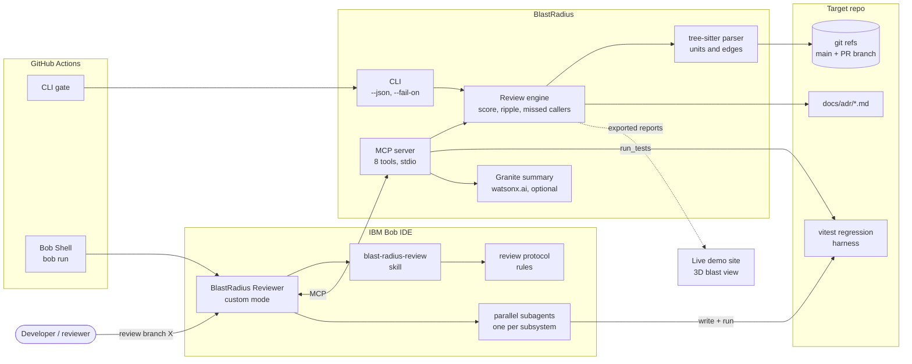
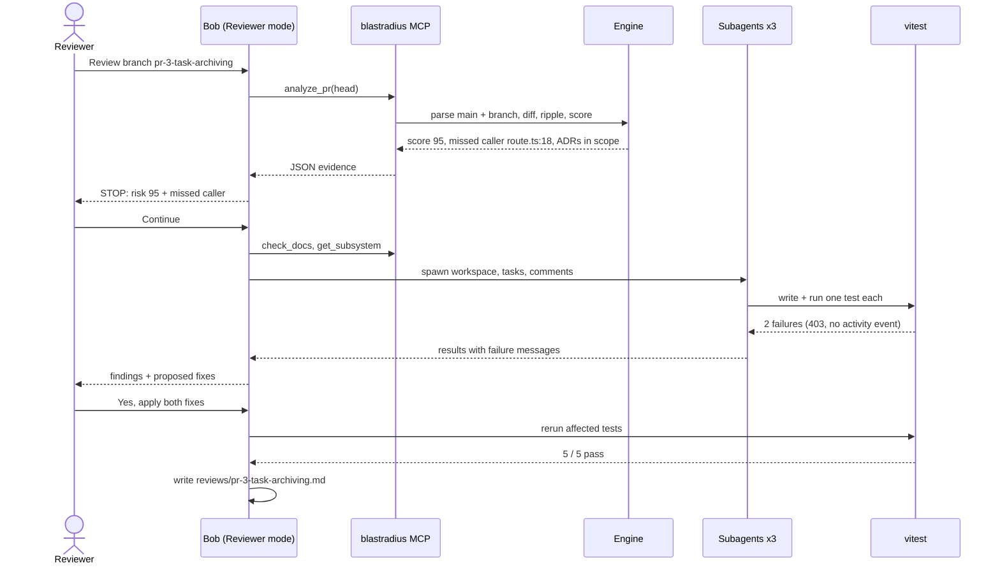
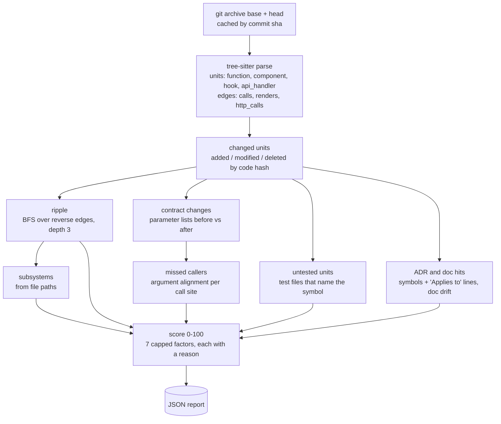
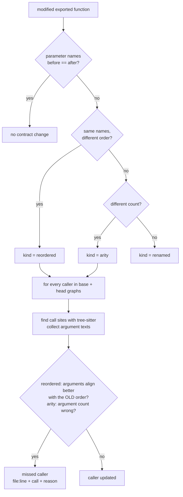
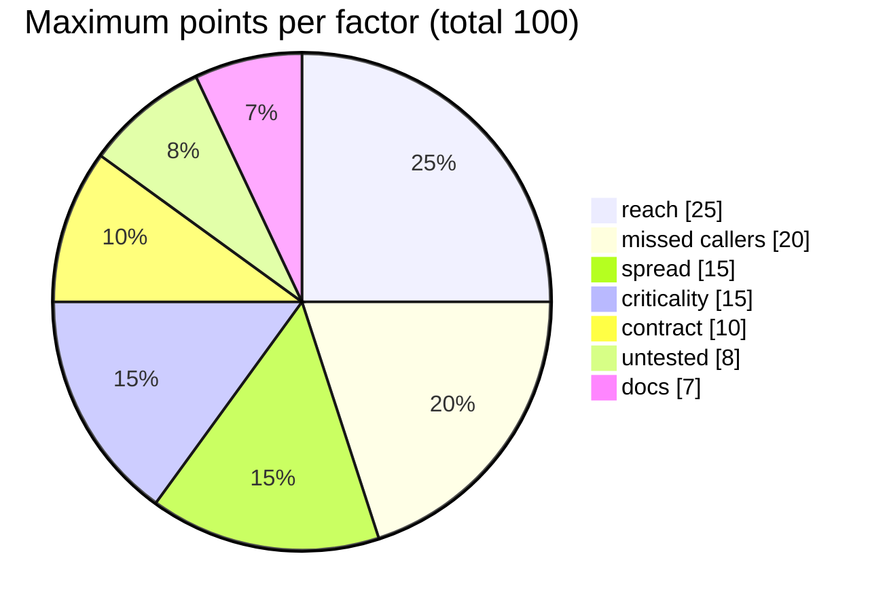
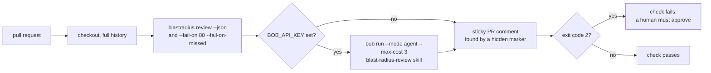
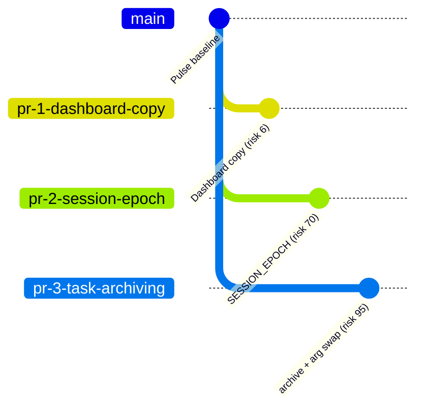
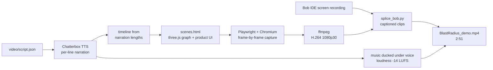
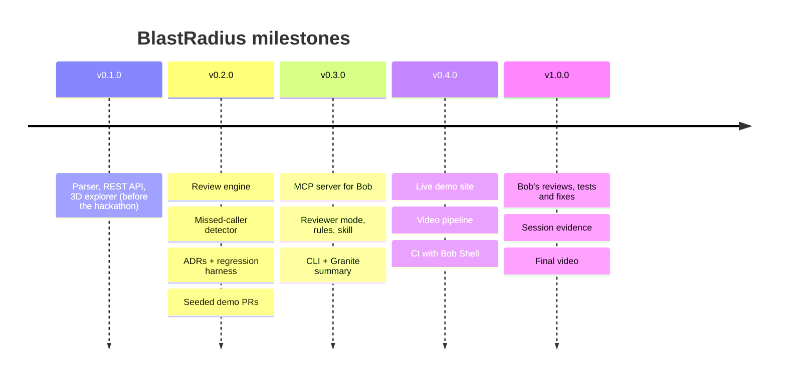

# BlastRadius design

This document explains how BlastRadius is built and why: the architecture, the review flow with IBM Bob, the engine, the score, CI, the demo setup, and the plan we followed. Every diagram is also in [`docs/diagrams/`](diagrams/). There are Mermaid sources (`.mmd`), rendered images (`.svg` and `.png`), and an editable draw.io file ([`blastradius.drawio`](diagrams/blastradius.drawio)).

## Principles

1. **Evidence is deterministic.** The engine parses git refs with tree-sitter and computes impact without a database, network or LLM. The same branch always gives the same report.
2. **Bob decides and proves.** Bob gets the evidence through MCP, judges it against the team's ADRs, and proves each finding with a test it writes and runs.
3. **A human approves.** Bob stops at a score of 70 or more, or when a caller was left behind. It changes application code only after a yes.
4. **Every claim cites something.** A finding points to a file and line, an ADR line, or a test result.

## 1. System architecture

The **engine** is a Python library (`blastradius/backend/app/review/`). Three front doors share it:
- the **MCP server**, which Bob uses (`app/mcp_server.py`)
- the **CLI**, for people and CI (`app/cli.py`)
- the **site exporter**, which feeds the live demo (`scripts/export_site_data.py`)

## 2. Review flow with IBM Bob

This is the sequence Bob followed in the recorded review of PR-3.

## 3. Engine pipeline

On the Pulse sample app a full parse is 237 units and 412 edges in about 0.9 s per ref. A PR analysis takes about 1 s.

## 4. Missed-caller detection

TypeScript can't catch a reordered pair of same-typed parameters. BlastRadius compares each call site with both parameter orders.

Alignment compares normalized names. For example, `user.id` matches `userId`, and `workspaceId` matches `workspaceId`. On PR-3, `getWorkspaceMember(workspaceId, user.id)` aligns with the old order `(workspaceId, userId)`, so `comments/[commentId]/route.ts:18` is flagged. The 17 updated callers are not.

## 5. Risk score

| Factor | Rule |
|---|---|
| reach | 2.5 × (sum of 1/distance over dependents + callers edited in the PR), capped at 25 |
| spread | 3 × (subsystems − 1), capped at 15 |
| criticality | 15 when auth, session, membership or db code changes, or a unit with 10+ callers |
| contract | 10 per exported signature change, capped at 10 |
| missed callers | 15 for the first, +5 for each more, capped at 20 |
| untested | 2 per changed or directly affected unit with no test, capped at 8 |
| docs | 3 per ADR or doc section in scope, +2 for doc drift, capped at 7 |

Bands are **low** (under 30), **medium** (30 to 59), **high** (60 to 79) and **critical** (80 and up). The CI gate fails at 80. Bob's stop condition is 70.

## 6. MCP tools

| Tool | Returns |
|---|---|
| `analyze_pr(head, base)` | The full report: score and factors, changed units, ripple, subsystems, contract changes, missed callers, untested units, doc hits |
| `get_dependents(symbol, ref, depth)` | Callers and renderers of a symbol, nearest first |
| `get_subsystem(name, ref)` | Units, API entry points, tests and ADRs of one subsystem |
| `find_untested(symbols, ref)` | The test files that reference each symbol |
| `check_docs(subsystems, symbols, ref)` | ADR and doc sections in scope, with rules and excerpts |
| `run_tests(paths)` | Real vitest pass or fail per test, with failure messages |
| `build_graph(ref)` | Unit and edge counts, subsystems, the most depended-on units |
| `summarize_review(head)` | A plain-English summary: Granite when configured, otherwise a template |

## 7. CI with Bob Shell

## 8. Demo setup

`scripts/seed_demo.sh` builds `demo-workspace/pulse` the same way every time, from `pulse/` plus three patches in `demo/prs/`.

| PR | Why it is in the demo |
|---|---|
| PR-1 | A leaf change. It shows that BlastRadius doesn't cry wolf. |
| PR-2 | A 3-line change to a hub (`getSession`, 24 direct callers) that reaches 13 subsystems. It shows a blast radius the diff can't show. |
| PR-3 | A feature plus a refactor. It has a caller left behind that type checks and CI can't catch, and a new route that breaks ADR-002. It shows Bob proving both bugs with tests. |

## 9. Video pipeline

## 10. Plan and roadmap

We planned the work in five milestones, and each one is a tagged release.

What we chose to build first, in order of its effect on the review workflow:
1. Put Bob in the review loop: the MCP server, the Reviewer mode, the skill and the rules.
2. Make the evidence trustworthy: deterministic engine output, file:line references, and the missed-caller detector.
3. Prove findings instead of asserting them: a regression harness that Bob's subagents write tests into and run.
4. Make it usable in three places: Bob IDE, the command line and CI.
5. Show it: seeded PRs, a live 3D demo and a narrated video with real Bob footage.

Next steps:
- More languages. The parser is TypeScript and TSX today; Python and Java are next.
- An MCP tool that lets Bob query past reviews ("which PRs touched billing this week?").
- Subsystem ownership read from `CODEOWNERS`, so Bob can tag the right reviewer.
- Calibrating the score weights against the team's real incident history.

## Repo map

| Path | What |
|---|---|
| `blastradius/backend/app/review/` | Engine: `engine.py`, `subsystems.py`, `gitrefs.py`, `granite.py` |
| `blastradius/backend/app/mcp_server.py`, `app/cli.py` | MCP server, CLI |
| `blastradius/backend/app/services/parser/` | tree-sitter TypeScript/TSX parser |
| `.bob/` | Reviewer mode, rules, skill, MCP config |
| `pulse/` | Sample app, ADRs, regression harness |
| `demo/prs/`, `scripts/seed_demo.sh` | Seeded PRs |
| `reviews/` | Bob's reports, tests and fixes |
| `bob_sessions/` | Bob task evidence |
| `site/` | Live demo |
| `video/` | Video pipeline |
| `docs/diagrams/` | Every diagram: `.mmd`, `.svg`, `.png`, `.drawio` |
